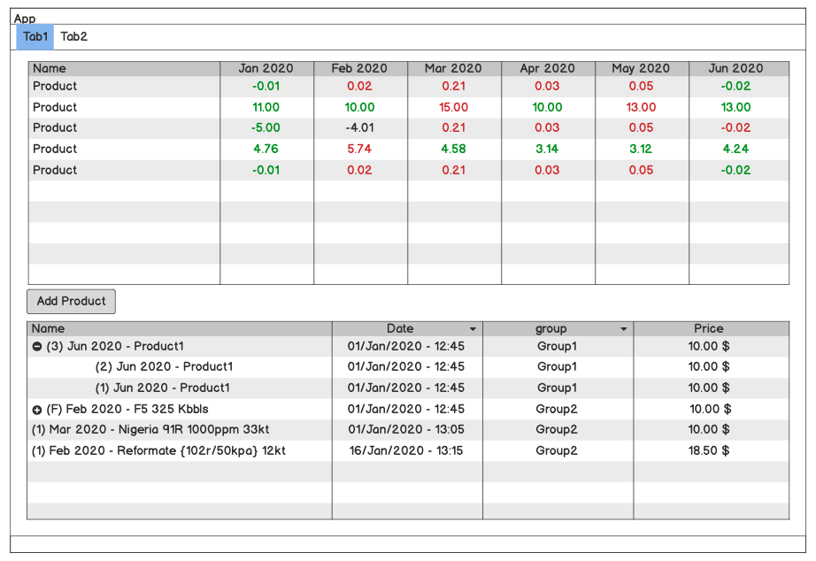

# Frontend Test

To be able to evaluate your capacity to learn we have set up a test for you to 
try a new language and framework and make a quick UI screen for us.

The task will be coded with WPF for Windows. You can use the community edition 
of Visual Studio for this.

An the screen to be coded is the following:

Information:

